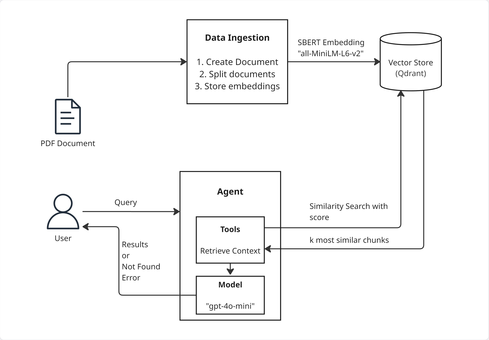
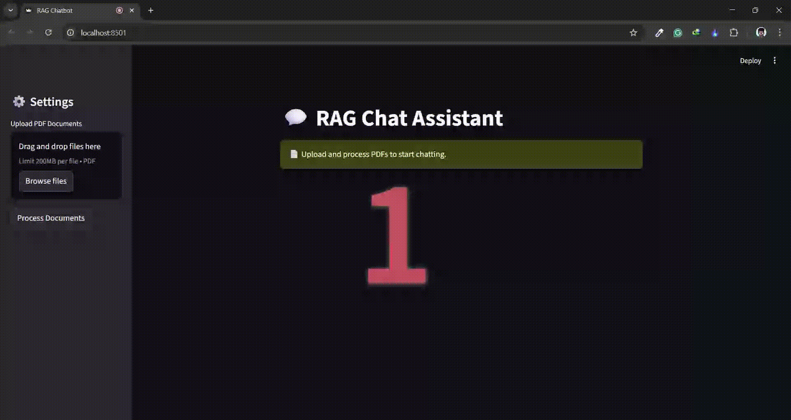

# 🗨️ PDF RAG Agent 
A simple RAG agent that searches through pdf to generate answers.




| Tools         |                                                                                          |
|---------------|----------------------------------------------------------------------------------------------|
| Streamlit     |  |
| Qdrant       |                |
| Langchain |        |
| SBERT         |                    |


## Features
- Get answers from your pdf instantly if similar results are found.
- Uses all-MiniLM-L6-v2 model from SBERT to create embeddings.
- Utilizes Qdrant as vector database to store and retrieve embeddings.
- Built using Langchain and Streamlit for easy deployment.


## Run deployed app
Link: https://pdf-rag-agent.streamlit.app/

## Live Demo
Here’s a quick look at how it works:
<!--  -->


## Run locally

1. Clone repository:
   ```bash
   git clone 'https://github.com/dipenpandit/pdf-rag-agent'
   cd pdf-rag-agent
   ```

2. Set up virtual environment:
   ```bash
   python -m venv venv
   source venv/bin/activate     # linux/mac
   venv\Scripts\activate        # cmd windows
   pip install uv      # uv for faster package installation
   uv pip install -r requirements.txt
   ```

3. Add secrets to `.env`:
   ```env
    QDRANT_API_KEY=your_qdrant_key
    QDRANT_URL="qdrant_cluster_url"
    LANGSMITH_API_KEY = "your_langsmith_key"
    LANGSMITH_ENDPOINT= "your_langsmith_endpoint"
    LANGSMITH_PROJECT= "your_langsmith_project_name"
    OPENROUTER_API_KEY = "your_openrouter_key"
   ```

3. Run the streamlit app:
    ```bash
    streamlit run main.py
    ```
